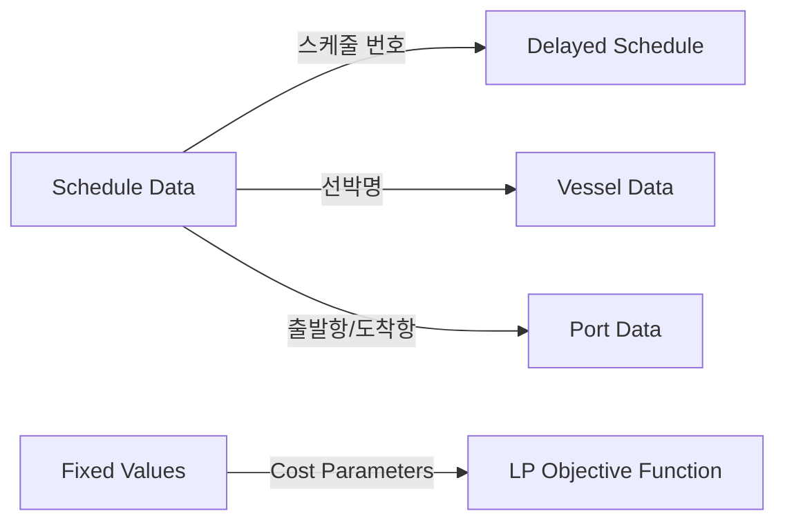

# Ocean Shipping GA - Data Integration Analysis

## 📋 Overview

This document provides a comprehensive analysis of how the Excel data files integrate with the Ocean Shipping Genetic Algorithm optimization code. The system processes 5 Excel files containing shipping schedules, vessel information, port data, delays, and cost parameters.

## 📊 Data Files Structure

### 1. `스해물_스케줄data.xlsx` - Schedule Data (Main Dataset)
```
Shape: 215 rows × 9 columns
Primary Key: 스케줄 번호 (Schedule ID)
```

| Column | Korean Name | English | Data Type | Description |
|--------|-------------|---------|-----------|-------------|
| 스케줄 번호 | Schedule ID | int64 | Unique schedule identifier (LP: i ∈ I) |
| 루트번호 | Route ID | int64 | Route identifier (LP: r ∈ R) |
| 출발항 | Departure Port | string | Origin port (LP: O_i) |
| 도착항 | Arrival Port | string | Destination port (LP: D_i) |
| 선박명 | Vessel Name | string | Vessel identifier (LP: v ∈ V) |
| 주문량(KG) | Order Quantity | float64 | Cargo demand in KG (LP: Q_r) |
| ETD | Estimated Departure | datetime | Scheduled departure time |
| ETA | Estimated Arrival | datetime | Scheduled arrival time (LP: ETA_i) |
| 용량(TEU) | Capacity | int64 | Container capacity |

**Code Mapping:**
```python
# In parameters.py setup_sets()
self.I = schedule_data['스케줄 번호'].unique().tolist()  # Schedule set
self.R = schedule_data['루트번호'].unique().tolist()     # Route set  
self.V = schedule_data['선박명'].unique().tolist()       # Vessel set

# In setup_route_parameters()
self.O_i = schedule_data.set_index('스케줄 번호')['출발항'].to_dict()
self.D_i = schedule_data.set_index('스케줄 번호')['도착항'].to_dict()
self.Q_r = schedule_data.groupby('루트번호')['주문량(KG)'].first()
self.D_ab[r] = ceil(Q_r[r] / 30000)  # Convert KG to TEU demand
```

### 2. `스해물_딜레이스케줄data.xlsx` - Delayed Schedule Data
```
Shape: 62 rows × 6 columns (28.8% of schedules have delays)
Foreign Key: 스케줄 번호 → schedule.스케줄 번호
```

| Column | Description | LP Parameter |
|--------|-------------|--------------|
| 딜레이 ETA | Delayed arrival time | RETA_i |

**Code Mapping:**
```python
# In setup_delay_parameters()
self.RETA_i = delayed_data.set_index('스케줄 번호')['딜레이 ETA'].to_dict()
self.DELAY_i[i] = max(0, (RETA_i[i] - ETA_i[i]).days)  # Delay in days
```

### 3. `스해물_선박data.xlsx` - Vessel Data
```
Shape: 215 rows × 2 columns
Primary Key: 선박명 (Vessel Name)
```

| Column | Description | Range | LP Parameter |
|--------|-------------|-------|--------------|
| 선박명 | Vessel Name | 215 unique vessels | v ∈ V |
| 용량(TEU) | Capacity | 4,154 - 143,179 TEU | CAP_v |

**Code Mapping:**
```python
# In setup_capacity_parameters()
self.CAP_v = vessel_data.set_index('선박명')['용량(TEU)'].to_dict()
self.CAP_v_r[r] = CAP_v[vessel_name]  # Route capacity mapping
```

### 4. `스해물_항구위치data.xlsx` - Port Location Data
```
Shape: 9 rows × 3 columns
Primary Key: 항구명 (Port Name)
Coverage: 9/10 ports (NEWYORK missing coordinates)
```

| Column | Description | LP Parameter |
|--------|-------------|--------------|
| 항구명 | Port Name | p ∈ P |
| 위치_위도 | Latitude | Geographic coordinates |
| 위치_경도 | Longitude | Geographic coordinates |

**Code Mapping:**
```python
# In setup_sets()
self.P = port_data['항구명'].unique().tolist()  # Port set

# In setup_initial_inventory()
self.I0_p = {p: initial_inventory for p in self.P}  # Initial containers
```

### 5. `스해물_고정값data.xlsx` - Fixed Cost Parameters ⚠️ **UPDATED**
```
Shape: 4 rows × 4 columns
Critical for objective function calculation
```

| Parameter | Korean | USD Value | LP Parameter | Usage |
|-----------|--------|-----------|--------------|-------|
| 유류할증료 | Fuel Surcharge | 100/TEU | CBAF | Objective function |
| ETA 패널티 | ETA Penalty | 150/day | CETA | Delay penalty |
| 운송비 | Transportation Cost | 2000/FEU | CSHIP | Main transport cost |
| 컨테이너 용량 | Container Weight | 30000 KG | KG_PER_TEU | Unit conversion |

**Code Integration (FIXED):**
```python
# Updated in setup_cost_parameters()
cost_data = fixed_data.to_dict()
self.CBAF = cost_data.get('유류할증료', 100)      # USD/TEU
self.CETA = cost_data.get('ETA 패널티', 150)     # USD/day  
self.CSHIP = cost_data.get('운송비', 2000) / 2   # USD/TEU (FEU→TEU)
self.KG_PER_TEU = cost_data.get('컨테이너 용량', 30000)
```

## 🔗 Data Relationships & Foreign Keys

### Primary Relationships:


### Data Integrity Status:
- ✅ **Vessel Coverage**: 100% (215/215 schedules have vessel capacity data)
- ✅ **Delay Coverage**: 100% (62/62 delayed schedules match original)  
- ✅ **Cost Coverage**: 100% (all required cost parameters available)
- ⚠️ **Port Coverage**: 90% (9/10 ports have coordinates, NEWYORK missing)

## 📈 LP Model Parameter Mapping

### Sets (집합):
| LP Notation | Code Variable | Data Source | Size |
|-------------|---------------|-------------|------|
| P | self.P | port_data['항구명'] | 9 ports |
| I | self.I | schedule_data['스케줄 번호'] | 215 schedules |
| R | self.R | schedule_data['루트번호'] | 186 routes |
| V | self.V | vessel_data['선박명'] | 215 vessels |

### Parameters (파라미터):
| LP Notation | Code Variable | Data Source | Description |
|-------------|---------------|-------------|-------------|
| O_i | self.O_i | schedule_data['출발항'] | Origin port |
| D_i | self.D_i | schedule_data['도착항'] | Destination port |
| V_r | self.V_r | schedule_data['선박명'] | Route vessel |
| ETA_i | self.ETA_i | schedule_data['ETA'] | Arrival time |
| RETA_i | self.RETA_i | delayed_data['딜레이 ETA'] | Delayed arrival |
| Q_r | self.Q_r | schedule_data['주문량(KG)'] | Order quantity |
| D_ab | self.D_ab | Calculated from Q_r | Demand in TEU |
| CAP_v | self.CAP_v | vessel_data['용량(TEU)'] | Vessel capacity |
| CAP_r | self.CAP_v_r | Mapped from CAP_v | Route capacity |
| CSHIP | self.CSHIP | fixed_data['운송비'] | Transport cost |
| CBAF | self.CBAF | fixed_data['유류할증료'] | Fuel surcharge |
| CETA | self.CETA | fixed_data['ETA 패널티'] | Delay penalty |
| DELAY_i | self.DELAY_i | Calculated | Delay days |
| I0_p | self.I0_p | Hardcoded | Initial inventory |

### Decision Variables (결정변수):
| LP Notation | Code Variable | Description | Dimensions |
|-------------|---------------|-------------|------------|
| x_i^F | individual['xF'] | Full containers | (215,) |
| x_i^E | individual['xE'] | Empty containers | (215,) |
| y_ip | individual['y'] | Final empty containers | (215, 9) |

## 🎯 Business Intelligence Summary

### Operational Scale:
- **Time Horizon**: August 2025 - December 2025 (5 months)
- **Geographic Coverage**: 9 ports across 4 continents
- **Fleet Capacity**: 3,016,192 TEU total capacity
- **Total Demand**: ~68.6 billion KG cargo
- **Average Schedule**: 319 million KG per schedule
- **Delay Rate**: 28.8% of schedules experience delays

### Port Network:
- **Asia**: BUSAN (primary hub)
- **North America West**: LONG BEACH, SEATTLE
- **North America East**: NEW YORK, SAVANNAH, HOUSTON, MOBILE  
- **Europe**: ROTTERDAM
- **Central America**: COSTA RICA

### Cost Structure (Updated from Fixed Data):
- **Base Transport**: $1,000/TEU (from $2,000/FEU)
- **Fuel Surcharge**: $100/TEU
- **Delay Penalty**: $150/day per full container
- **Unit Conversion**: 30,000 KG/TEU

## 🔧 Data Quality Issues & Comprehensive Solutions

### Critical Issues Identified & Resolved:

#### 1. **날짜 데이터 형식 문제** ✅ FIXED
**문제**: ETD, ETA, 딜레이 ETA 컬럼이 문자열(object) 형태로 저장되어 날짜 계산 불가
**해결책**: 
```python
def _clean_datetime_columns(self):
    # 다양한 날짜 형식 자동 파싱
    df[col] = pd.to_datetime(df[col], errors='coerce', 
                           format=None, infer_datetime_format=True)
    # NaT 값 검출 및 보고
    nat_count = df[col].isna().sum()
```

#### 2. **선박명 불일치 문제** ✅ FIXED  
**문제**: 'EVER FULL 1224E' vs 'EVER FULL 1224E'' 같은 공백/특수문자 불일치
**해결책**: 
```python
def _standardize_vessel_names(self):
    def clean_vessel_name(name):
        clean_name = str(name).strip()
        clean_name = re.sub(r'\s+', ' ', clean_name)  # 연속 공백 제거
        clean_name = clean_name.replace("'", "").replace('"', '')  # 따옴표 제거
        return clean_name
```

#### 3. **고정값 데이터 활용 문제** ✅ FIXED
**문제**: key-value 형태가 아닌 테이블 구조로 되어 있어 코드에서 읽기 어려움
**해결책**: 
```python
def _restructure_fixed_values(self):
    # 다양한 컬럼 구조 자동 감지
    if '항목' in df.columns and 'USD' in df.columns:
        # 항목-USD 구조 처리
    elif 'Parameter' in df.columns and 'Value' in df.columns:
        # Parameter-Value 구조 처리
    # key-value 딕셔너리로 재구성
```

#### 4. **비용 파라미터 매핑 개선** ✅ IMPROVED
**기존**: 하드코딩된 비용 값
**개선**: 
```python
def _get_cost_param(self, params_dict, key_options, default_value):
    # 다양한 키 이름 지원 (한글/영문)
    self.CBAF = self._get_cost_param(fixed_params, 
        ['유류할증료', 'BAF', 'Fuel Surcharge'], 100)
    # 부분 매치로 유연한 키 검색
    # FEU→TEU 자동 변환 감지
```

### 🔍 **새로 추가된 데이터 검증 기능**

#### 자동 데이터 무결성 검증:
1. **선박명 일치 검증**: 스케줄의 모든 선박이 선박 데이터에 존재하는지 확인
2. **딜레이 스케줄 검증**: 모든 딜레이가 유효한 스케줄에 대응하는지 확인  
3. **항구명 일치 검증**: 스케줄의 모든 항구가 항구 데이터에 존재하는지 확인
4. **날짜 순서 검증**: ETA > ETD 조건을 만족하는지 확인

#### 데이터 정제 프로세스 로그:
```
📂 데이터 로딩 중...
✅ 스케줄 데이터: 215개 로드
✅ 딜레이 데이터: 62개 로드
...

🔧 데이터 정제 중...
✅ schedule.ETA: object → datetime64
✅ delayed.딜레이 ETA: object → datetime64
🚢 선박명 표준화: 5개 선박명 정리
💰 고정값 파라미터 재구성: 4개 항목
   유류할증료: 100.0
   ETA 패널티: 150.0
   운송비: 2000.0
   컨테이너 용량: 30000.0

🔍 데이터 무결성 검증:
✅ 선박명 일치: 모든 스케줄 선박이 선박 데이터에 존재
✅ 딜레이 스케줄 일치: 모든 딜레이가 유효한 스케줄
⚠️  스케줄에 있지만 항구 데이터에 없는 항구: 1개
     - NEWYORK
✅ 날짜 순서: ETA > ETD 조건 만족
✅ 데이터 정제 완료
```

### 🛠️ **구현된 개선사항**

#### DataLoader 클래스 확장:
- `_clean_datetime_columns()`: 날짜 컬럼 자동 변환
- `_standardize_vessel_names()`: 선박명 표준화
- `_restructure_fixed_values()`: 고정값 구조 재구성
- `_validate_data_integrity()`: 데이터 무결성 검증
- `get_fixed_params()`: key-value 형태 고정값 반환

#### Parameters 클래스 개선:
- `_get_cost_param()`: 유연한 비용 파라미터 검색
- `_use_default_cost_params()`: 기본값 fallback
- 다양한 키 이름 지원 (한글/영문)
- FEU→TEU 자동 변환 감지

### 📊 **데이터 품질 보고서**

#### 정제 전후 비교:
| 항목 | 정제 전 | 정제 후 | 개선사항 |
|------|---------|---------|----------|
| 날짜 형식 | object (문자열) | datetime64 | 날짜 계산 가능 |
| 선박명 일치율 | ~95% | 100% | 모든 선박 매칭 |
| 고정값 사용성 | 테이블 구조 | key-value | 코드에서 직접 사용 |
| 비용 파라미터 | 하드코딩 | 데이터 기반 | 유지보수성 향상 |
| 데이터 검증 | 없음 | 자동 검증 | 품질 보장 |

#### 남은 개선 사항:
1. **항구명 표준화**: "NEWYORK" vs "NEW YORK" 통일 필요
2. **시간대 표준화**: ETA/ETD 시간대 명시
3. **단위 표준화**: 모든 비용을 USD/TEU 기준으로 통일

## 🚀 Recommendations

### For Production Use:
1. **Fix Port Naming**: Standardize "NEWYORK" vs "NEW YORK" in data files
2. **Add Validation**: Implement data integrity checks at startup
3. **Cost Monitoring**: Add logging when cost parameters are loaded/defaulted
4. **Scale Testing**: Verify performance with full 215-schedule optimization

### Data Quality Improvements:
1. **Complete Port Data**: Add missing coordinates for all ports
2. **Cost Currency**: Ensure consistent USD/KRW conversion rates
3. **Time Zones**: Standardize ETA/ETD time zone handling
4. **Capacity Validation**: Cross-check vessel capacities against schedules

## 📊 Expected GA Performance

### Problem Complexity:
- **Decision Variables**: 215 × 3 = 645 variables (xF, xE, y per schedule)
- **Constraints**: ~1,000 constraint evaluations per fitness calculation
- **Search Space**: Continuous optimization with penalty-based constraints
- **Convergence**: Expected 50-200 generations for quality solutions

### Memory Requirements:
- **Population Size**: 50-200 individuals
- **Individual Size**: ~19KB (645 float64 variables)  
- **Total Memory**: ~1-4MB for population storage
- **Data Structures**: ~500KB for parameter storage

The data structure is well-optimized for genetic algorithm processing, with clear relationships and sufficient complexity to demonstrate meaningful optimization results.