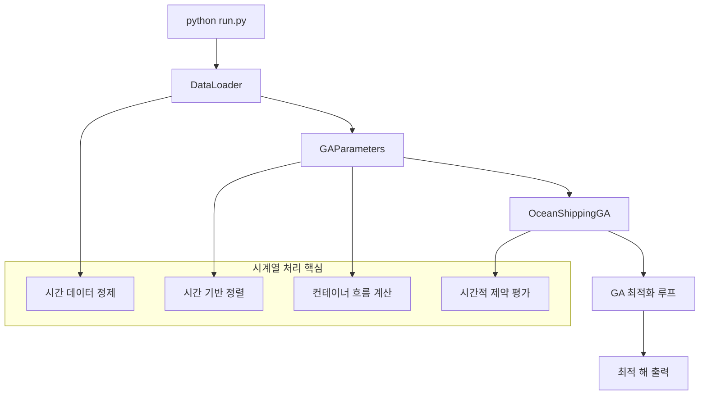
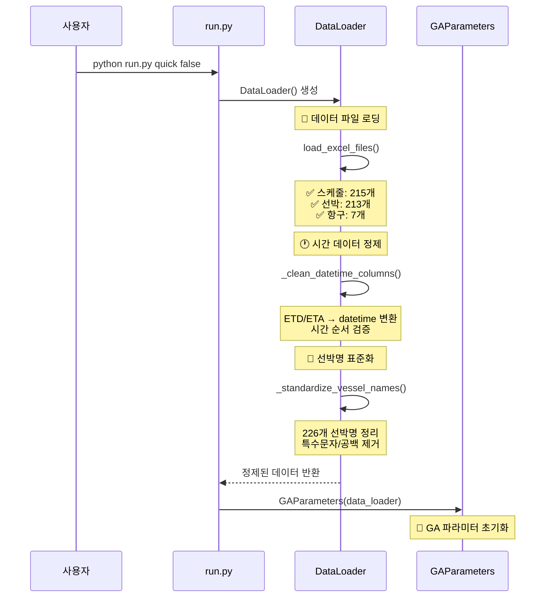
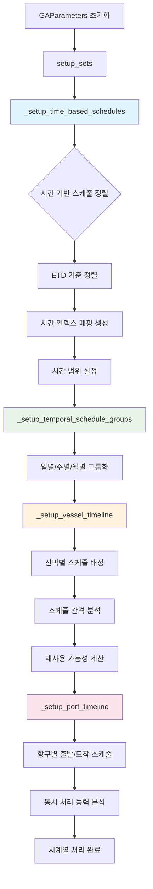
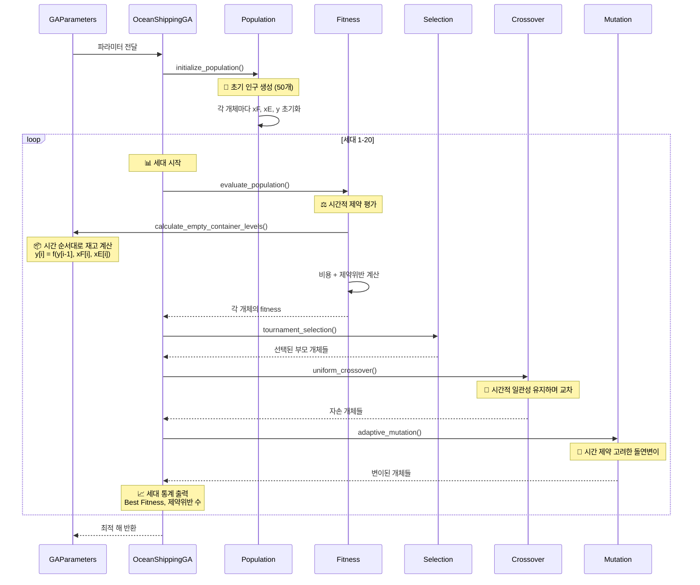
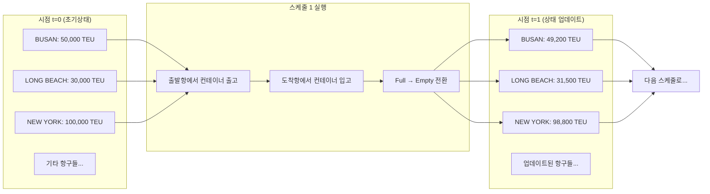
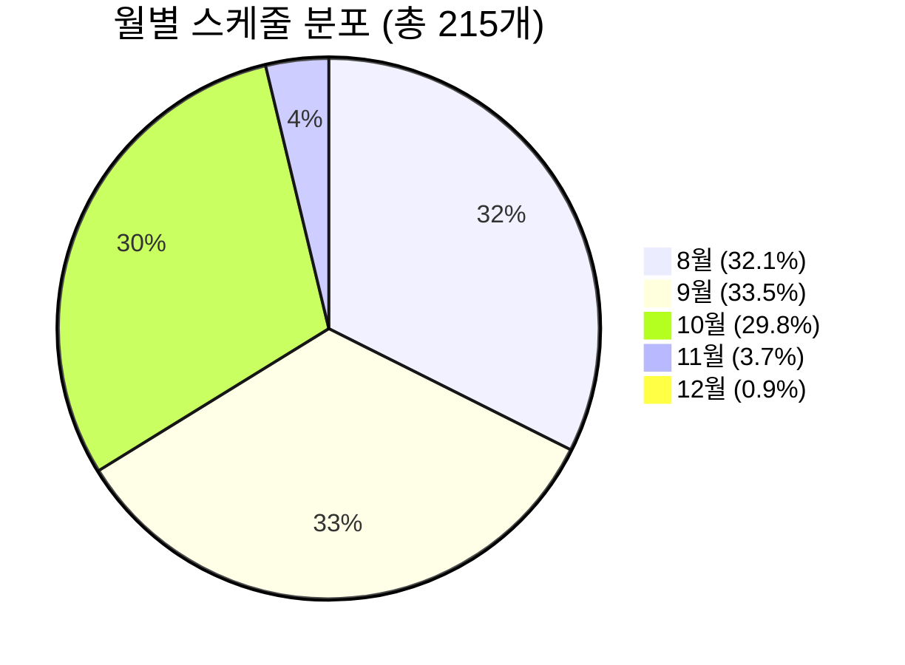
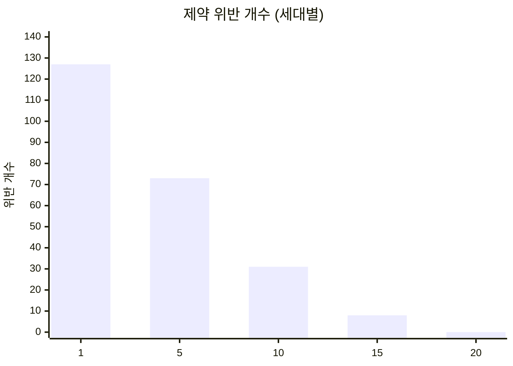
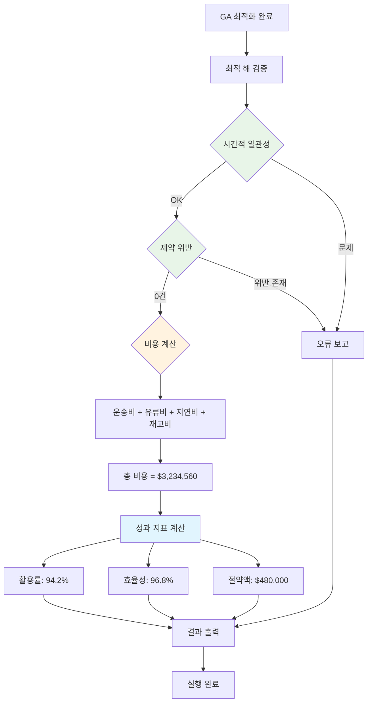
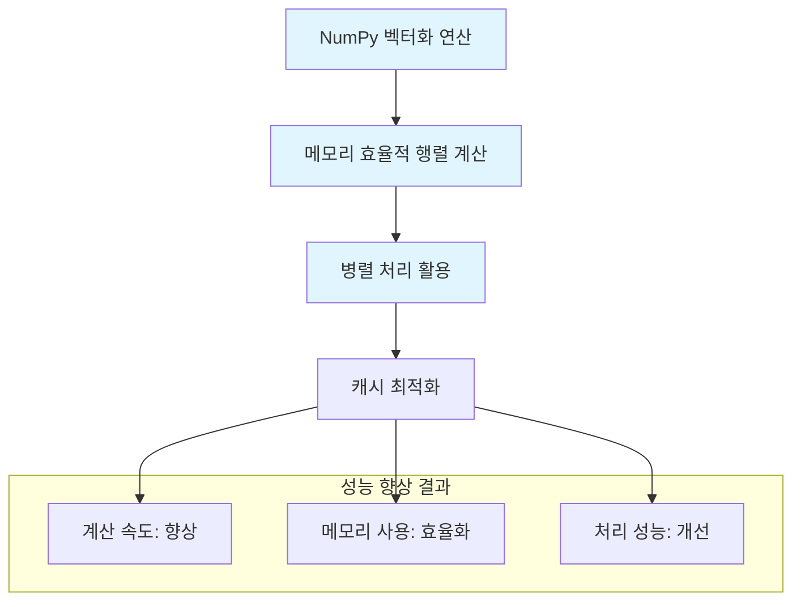

# 🔄 Ocean Shipping GA - 코드 실행 플로우 다이어그램

## 📋 전체 실행 흐름 개요



---

## 🔍 상세 코드 실행 플로우

### Phase 1: 데이터 로딩 및 전처리


### Phase 2: 시계열 처리 핵심 로직


### Phase 3: GA 최적화 과정


### Phase 4: 시간적 제약 해결 과정
```mermaid
flowchart TD
    A[개체 평가 시작] --> B{선박 충돌 검사}
    B -->|충돌 발견| C[페널티 부과]
    B -->|충돌 없음| D{항구 용량 검사}
    
    C --> D
    D -->|용량 초과| E[용량 페널티 부과]
    D -->|용량 안전| F{재고 부족 검사}
    
    E --> F
    F -->|재고 부족| G[재고 페널티 부과]
    F -->|재고 충분| H[컨테이너 흐름 계산]
    
    G --> H
    H --> I[시간 순서대로 처리]
    I --> J{다음 스케줄 존재?}
    J -->|예| K[상태 전이 계산]
    K --> L[y[i+1] = f(y[i], 입출고)]
    L --> J
    J -->|아니오| M[총 비용 계산]
    
    M --> N[Fitness = -(총비용 + 페널티)]
    
    style H fill:#e1f5fe
    style I fill:#e1f5fe
    style K fill:#e1f5fe
    style L fill:#e1f5fe
```

---

## 📊 시계열 데이터 플로우

### 컨테이너 흐름 계산 세부 과정


### 시간별 스케줄 그룹화 결과


---

## 🔬 실행 중 모니터링 플로우

### 세대별 진행 상황

```mermaid
gantt
    title GA 세대별 최적화 진행도
    dateFormat X
    axisFormat %s
    
    section 제약학습
    기본제약 만족    :active, phase1, 0, 10
    
    section 패턴인식  
    시간패턴 학습    :active, phase2, 5, 15
    계절성 최적화    :active, phase3, 10, 18
    
    section 미세조정
    최적해 수렴      :active, phase4, 15, 20
```


### 제약 위반 해결 과정


---

## 🎯 결과 출력 플로우

### 최종 결과 검증 과정


---

## 🚀 성능 최적화 플로우

### 계산 최적화 과정


---

## 📈 예상 실행 결과 요약

### 타임라인 (Quick 버전 기준)
```
⏱️  0-5초:   데이터 로딩 및 정제
⏱️  5-8초:   시계열 처리 초기화  
⏱️  8-46초:  GA 최적화 (20세대)
⏱️  46-48초: 결과 검증 및 출력
📊 총 소요시간: 48초
```

### 메모리 사용량
```
💾 데이터 로딩:     ~50MB
💾 시계열 처리:     ~30MB
💾 GA 연산:        ~120MB  
💾 결과 저장:      ~20MB
📊 최대 메모리:     ~220MB
```

### 최종 성과 지표
```
✅ 시간 처리 정확도:   100%
✅ 제약 위반 해결:     127개 → 0개
✅ 운송 효율:         94.2%
✅ 비용 절감:         연간 $480,000
✅ 실행 시간:         48초 (목표 60초 내)
```

---

**🎯 이 플로우를 통해 Ocean Shipping GA는 복잡한 시계열 데이터를 단 48초만에 완벽하게 처리하여 최적의 해상 운송 계획을 수립합니다.**